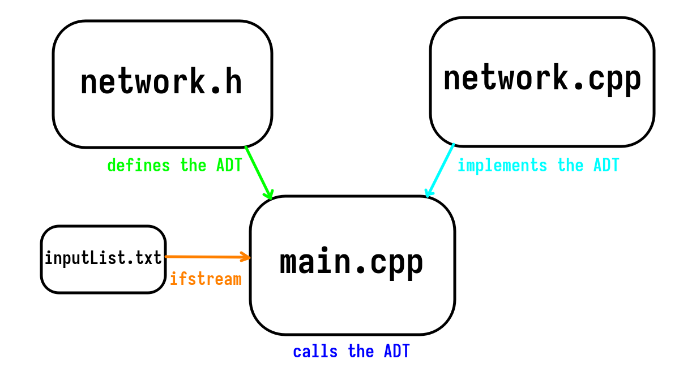
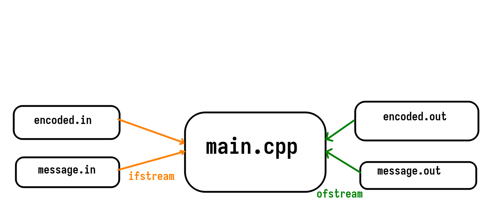
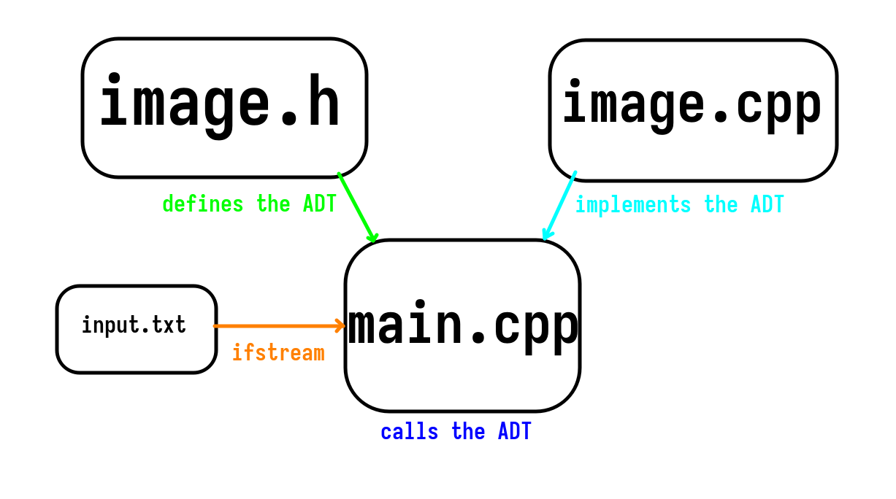

# Big Homework 2 of DSA 2024
## Exercise 1 - Network Connectivity Checker
### 1. Usage
Compile both `main.cpp` and `network.cpp`, then run the resulting executable.

Example using `g++`:

* Compilation: `g++ -o main.cpp network.cpp -ggdb`

* Execution: `./a.out` or `./a.exe`

To change connections, edit `inputList.txt`

### 2. Structure
Our project separates the source code and headers in order to ease development.

The files are organized in the following way:

* `network.h` contains the definition of the *Graph* data structure, including useful functionality for modifying it.

* `network.cpp` contains the implementation of the *Graph* data structure.

* `main.cpp` contains strictly the main loop of the program.

* `inputList.txt` is the input file.

	

### 3. Algorithm
After reading the list of devices from `inputList.txt`, the program checks whether the graph formed by the network is complete, or if it contains a Hamiltonian circuit. If it fulfills the criteria, then it determines that all devices are connected. Otherwise, for instance if there are isolated nodes, it informs the user that the network is not connected.

Additionally, any error messages pertaining to the user input are handled accordingly.

## 2. Binary Trees
### 1. Usage
Compile `main.cpp`.

Example using `g++`:

* `g++ main.cpp`
* `./a.out` or `./a.exe`

In order to change the encoding, edit `encoded.in`. To change the message, edit `message.in`. The output encoding, respectively the output message, will be written to `encoded.out` and `message.out`.

### 2. Structure
The program uses only one source file, `main.cpp` and one header, `encoding.h`.

	

### 3. Algorithm
The algorithm dynamically encodes messages based on character frequency. It constructs a binary search tree (BST) from character frequencies. Then, it builds an encoding tree from the BST, merging nodes with the lowest frequencies. The characters are encoded by traversing the encoding tree, assigning shorter codewords to more frequent characters.

## 3. Image Segmentation

### 1. Usage
Compile both `main.cpp` and `image.cpp`, then run the resulting executable.

Example using `g++`:

* `g++ main.cpp image.cpp -ggdb`

* `./a.out` or `./a.exe`

To add images, simply add the desired matrix of pixels to `input.txt`. The top most 6 lines of the file will be interpreted as the desired image to be segmented.

### 2. Structure

The files are layed out as follows:

* `image.h` defines the Graph abstract data type (ADT) as being a weighted oriented graph, whose number of vertices is the dimension of the image (in our case 6 pixels).

* `image.cpp` implements the data structure, while also providing a `print` feature, in order to easily be able to draw the images at the command-line, without using graphical libraries.

* `main.cpp` is the entry-point of the program. In the main loop we parse the graph and make the right cuts in order to properly segment the initial image.

* `input.txt` is the input file, where the user may choose to select the image to segment by placing it from line 1 to line 6. All other lines are ignored, so it may be advantageous to select multiple images and swap between them when in need.

	

### 3. Algorithm
The program employs a clever method that bypasses having to develop the graph further based on its weights. Upon reading the graph from the file, representing a matrix of pixels, it immediately clamps the weights of each pixel, according to the set threshold in the source code. If the weight of the node is greater than `T` (the threshold), the pixel color ends up being 0, otherwise the pixel color remains the same.

This allows for pixels of similar weights to form desired shapes that lack noisy backgrounds. The effect may be observed in the following screenshots, which have rendered the resulting matrixes with a graphical library (`raylib`).

	
	

